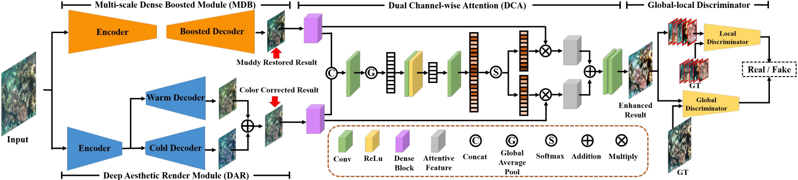

# TOPAL
This is an implement of the TOPAL,
**“[Target Oriented Perceptual Adversarial Fusion Network for Underwater Image Enhancement](https://ieeexplore.ieee.org/abstract/document/9774330)”**, 
Zhiying Jiang, Zhuoxiao Li, Shuzhou Yang, Xin Fan, Risheng Liu*, IEEE Transactions on Circuits and Systems for Video Technology __(TCSVT)__, 2022.

## Overview


## Installation
Clone this repo:
```
conda create -n TOPAL python=3.7
conda activate TOPAL
conda install pytorch torchvision torchaudio cudatoolkit=11.3 -c pytorch
pip3 install thop matplotlib scikit-image opencv-python yacs joblib natsort h5py tqdm
```

## Download
Download the pre-trained model and put it in _networks/model_
- [Baidu Yun](https://pan.baidu.com/s/1fD51_65ppoMoK1jp0XnWGA) \
code:
​```
vtab
​```
- [Google Drive](https://drive.google.com/file/d/1Y3ajKmqzD5lmYB4wYSUrzAQNqeVaE5_q/view?usp=sharing)

## Quick Run
Put the images you want to process in the _Underwater_ folder. \
To test the pre-trained models for Underwater Enhancement on your own images, run
​```
python main.py
​``` \
Results will be shown in _Result_ folder.

## Citation
If you use TOPAL, please consider citing:
```
@ARTICLE{TOPAL,
 author={Jiang, Zhiying and Li, Zhuoxiao and Yang, Shuzhou and Fan, Xin and Liu, Risheng},
 journal={IEEE Transactions on Circuits and Systems for Video Technology},
 title={Target Oriented Perceptual Adversarial Fusion Network for Underwater Image Enhancement},
 year={2022},
 pages={1-1},
 doi={10.1109/TCSVT.2022.3174817}}
```

## Contact
Should you have any question, please contact [Zhiying Jiang].

[Zhiying Jiang]:zyjiang0630@gmail.com
